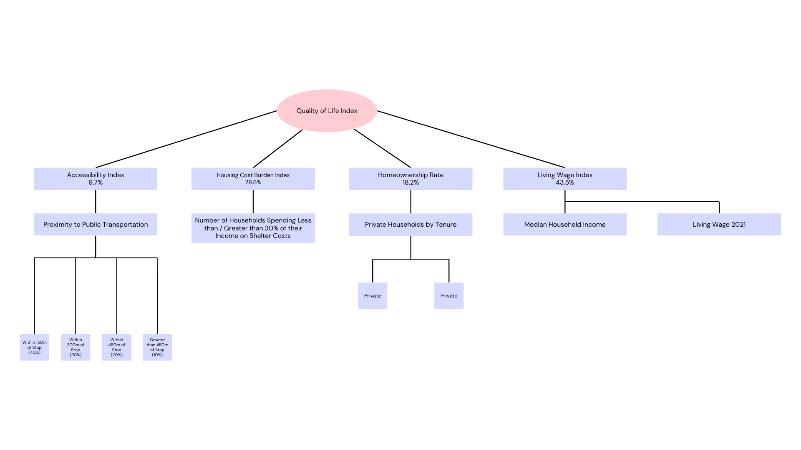

# Vancouver CityScope 

## Team
Kyle Vu\
Noah Shibagaki-Ong\
Pierre Koelich

## 1. Mission Statement

In recent years, people around the world have had to face a global cost of living crisis, fuelled by factors such as general inflation, supply chain issues, and geopolitical instability. In 2024, Statistics Canada released a report stating that nearly half (45%) of Canadians reported that rising prices were greatly affecting their ability to meet their day-to-day expenses, 12% higher than reported two years prior in 2022 (33%). With increasing costs for housing, energy, groceries, and transportation, Canadians have needed to find ways to share expenses through bill splitting strategies such as taking public transportation, buying in bulk, and cohabiting with others.

It is also important to note that rising costs tend to disproportionately impact vulnerable communities, exacerbating pre-existing problems related to housing insecurity and health inequality in lower-income populations.

The Geonas Brothers aim to enable both citizens and decision-makers to assess key indicators of quality of life across the City of Vancouver, both individually and collectively via an index.

Our project looks at spatial differences across the three categories of financial stress, housing stability, and sustainable transport methods, drawing inspiration from Canada’s Quality of Life Hub — launched by Statistics Canada in March 2022 — which brings together data for 84 indicators, spread across five domains (prosperity, health, society, environment, and good governance).

Our app, Vancouver CityScope, is an interactive visual information product containing a map layer with a quality of life score assessed via quality of life indicators such as income to living wage ratio, homeownership rate, housing cost burden index, and transit accessibility. Each of the layers that comprises the final product is also able to be viewed individually. 

## 2.Statement of Characteristics

## 3. Methodology

To accomplish our goal of showing quality of life we first begin by generating the individual indices. These are primarily off of census data from Statistics Canada and a Vancouver roads network that we built. The exact steps are detailed in the workflow section, below is the explanation for the indices:

### 3.1 Homeownership rate

Homeownership rate is traditionally associated with a more stable financial situation, increased social, and civic engagement, and neighbourhood stability. We are therefore using it as a proxy measure for housing security. The census data from StatCan provides data on private households by tenure, separating between owner, renter, and dwelling provided by the local government, First Nation or Indian band (excluded from calculation). It is only a 25% dataset, so it can provide an estimate of the proportion of owners to renters in this area.

The base calculation is:

 Homeownership rate = Homeowners(Homeowners+Renters)

### 3.2 Financial Stress

#### 3.2.1 Living wage index

Living Wage BC states that a living wage is the hourly amount someone needs to earn in order to cover basic expenses. These expenses include food, clothing, rental housing, transportation, childcare, and emergency savings. This is currently calculated around the most common family unit in BC, a two-parent family with two children. In 2021, the year the census data was collected, the living wage was calculated at $20.52/hour, which resulted in an annual income of $37,346, which was rounded up to $37,500 for the purposes of this analysis. 

The median household income in each census geography was compared to the estimated living wage, to show how much above or below the living wage a specific census geography is.

Calculation:

Living Wage Index = Median Household Income37500

Values below 1: Below living wage
Values above 1: Above living wage

#### 3.2.2 Housing Cost Burden Index

A commonly used measure adopted by Statistics Canada is that if shelter costs are more than 30% of income, then housing is considered unaffordable(5). Statistics Canada collects data of how many households spend more than 30% of their income on shelter. This is a 25% dataset, so we are able to show proportionally how many households are spending more than 30% of their income on housing per census geography.

Calculation:
A = number of households spending less than 30% of their income on shelter costs.
B = number of households spending more than 30% of their income on shelter costs.
Total = total number of households (A + B)
This is then normalized to to a scale from 0 to 1
Housing Cost Burden Index =[B Total − A Total+1] 2 

A value of 0 for this index means that none of the households in this census tract are cost-burdened by housing, and a value of 1 means that all of them are.

### 3.3 Accessibility Index

The Accessibility Index (AI) measures proximity to public transportation using a weighted sum. Being within an appropriate walking distance to a bus stop from your house typically suggests greater accessibility to public transportation. Higher values indicate better accessibility to public transportation.
Accessibility Index = (Area150m ​× 0.40) + (Area300m​ × 0.30) + (Area450m​ × 0.20)
+ (Area>450m​ × 0.10)

##### A higher Accessibility Index indicates better public transportation accessibility, while a lower value signifies reduced access to transit services.

#### All derived values from 2.1 - 2.3 were min-max normalized to ensure comparability

### 3.4 Quality of Life Index

The Quality of Life Index is a composite index created using Multi-Criteria Decision Analysis (MCDA) and the Analytic Hierarchy Process (AHP). It integrates the four indices to assess overall quality of life:
Pairwise comparisons in AHP were used to determine the relative importance of each criterion:
Living Wage Index: 43.5%
Housing Cost Burden Index: 28.6%
Homeownership Rate: 18.2%
Accessibility Index: 9.7%
Quality of Life Index = (Homeownership Rate × 0.182) +(Housing Cost Burden Index × 0.286) + (Accessibility Index × 0.097) +(Living Wage Index × 0.435)

##### A lower QOLI value indicates poorer quality of life, characterized by higher housing cost burdens, lower wages, reduced homeownership, and limited transit access.

## 4. Workflows

### 4.1 Data isolation 

1. Extract data from Canadian census profile using ArcGIS Data Interoperability tool by isolating the rows that contain:
the number of households by tenure owner and renter: CHARACTERISTIC_ID 1415 and 1416
Number or people spending more and less than 30% of their incomes on shelter cost: CHARACTERISTIC_ID 1466 and 1467
Total median household income: CHARACTERISTIC_ID 243

1. The resulting csv file will have the isolated values for each CHARACTERISTIC_ID for all census tracts and dissemination areas.
  
1. The data is then joined to a polygon dataset clipped to the City of Vancouver extent, so that only the census tracts and dissemination areas in Vancouver are visible. Each DA or CT polygon now contains the information from the Census Profile csv and can be used for further data analysis.

### 4.2 Homeownership rate:

1. Each census tract or dissemination area has a value for the number of households by tenure - owner and renter in two separate fields. To calculate homeownership rate we have to create an empty field and populate the field with the Calculate Field tool, dividing the number of owners by the combined total of owners and renters.
1. Find the average homeownership rate, found using explore statistics in ArcGIS Pro. Create an empty field, and assign all the values to the average rate.
1. Configure a popup to compare the average homeownership rate to the one present in each census geography.
1. Create another empty field
1. Use explore statistics to find the minimum and maximum values for the field, then normalize each entry according to those values. This will be used for comparison in the MCDA
### 4.3 Living wage index:
1. Create an empty field.
1. Calculate the field by dividing median household income by the estimated living wage.
1. Create another empty field, and set the value to the estimated living wage, 37500.
1. Configure the pop ups to compare the median household income with the estimated living wage for each feature.
1. Create another empty field
1. Use explore statistics to find the minimum and maximum values for the field, then normalize each entry according to those values. This will be used for comparison in the MCDA.

### 4.4 Housing cost burden index:
1. Each census tract contains data for the number of people who are spending more than and less than 30% of their median household income on shelter costs. Start by creating an empty field, label it correctly and assign it the correct data type.
1. Use the field calculator to calculate the field according to the formula detailed in section 2.2.2
1. Configure a pie chart to show the percentage spending more and less than 30% of their income on housing.
1. Create another empty field
1. Use explore statistics to find the minimum and maximum values for the field, then normalize each entry according to those values. This will be used for comparison in the MCDA.

### 4.5 Accessibility Index
#### 4.5.1 Service Area Calculation
Using a network dataset, service areas were created around public transportation stops at four distance thresholds:
1. 150m (high accessibility)
2. 300m (moderate accesibility)
3. 450m ( low accessibility)
4. Greater than 450m (very low accessibility)

The total land area covered by each service area within each census tract was calculated.

#### 4.5.2 Accessibility Index Calculation

For each census tract, the proportion of land covered by each service area was computed:
Proportion=Service Area within Census TractTotal Census Tract Area\text{Proportion} = \frac{\text{Service Area within Census Tract}}{\text{Total Census Tract Area}}
A weighted sum approach was applied to prioritize proximity to transit stops, using the following weights:

##### AI=(Area150m×0.40)+(Area300m×0.30)+(Area450m×0.20)+(Area>450m×0.10)

#### 4.6 Quality of Life Index

The Quality of Life Index (QOLI) was developed using four key indicators(calculated above):
1.Homeownership Rate: Measures housing stability.
1.Housing Cost Burden Index: Percentage of households spending more than 30% of income on housing.
1. Accessibility Index: Proximity to public transit.
1. Living Wage Index: Ratio of median household income to the living wage ($37,500 per year).

All indicators were min-max normalized to ensure comparability:

Pairwise comparisons were conducted to establish priority weights for each criterion using the Analytic Hierarchy Process (AHP). The resulting weights were:
#### Living Wage Index: 43.5%
#### Housing Cost Burden Index: 28.6%
#### Homeownership Rate: 18.2%
#### Accessibility Index: 9.7%

The final QOLI score for each census tract was calculated as:
#### QOLI=(Homeownership Rate × 0.182)+(Housing Cost Burden Index × 0.286)+(Accessibility Index × 0.097)+(Living Wage Index × 0.435)

### 5. Limitations

### Temporal resolution

A major limitation is the currency of the census dataset. This data comes from the 2021 census, the data can be considered behind the times. The issues around financial instability in the country were only emerging when this census data was collected. This can be shown with the BC living wage going from $20.52/hour(3) to $27.05/hour (4).  Recently the true magnitude of the problem has revealed itself, and our census data lags behind, and therefore the picture that our app paints.

### Weights

The weights assigned to each layer were derived from pairwise comparisons using the Analytic Hierarchy Process (AHP). This method, while widely used, inherently involves subjective judgments, which may not perfectly reflect real-world priorities. Consequently, the final results are influenced by these subjective weight assignments, a limitation common to multi-criteria decision analyses (MCDA). While unavoidable in many MCDA applications, it's important to acknowledge that variations in these weights could lead to differing outcomes. 

### Problem Structuring

Our Quality of Life index incorporated four key factors: accessibility, living wage index, housing cost burden index, and homeownership rate. However, it's important to acknowledge that quality of life is a multifaceted concept. Statistics Canada's Quality of Life Hub, for instance, identifies 84 distinct factors, including crucial aspects like environmental quality, social connection, and health. Due to time and data limitations, our analysis represents only a subset of these factors. Consequently, while the app provides valuable insights, it may not fully capture the nuanced reality of quality of life in each location. Users should interpret the results with this limitation in mind, understanding that other significant factors could influence their overall assessment.

## 6. Data dictionary

| Name    | Source |    link | 
| -------- | ------- |  ------- |
| Census tract digital boundary 2021  | Statistics Canada    | [Link](https://www12.statcan.gc.ca/census-recensement/2021/geo/sip-pis/boundary-limites/index2021-eng.cfm?year=21) |
| Dissemination area digital boundary 2021 | Statistics Canada | [Link](https://www150.statcan.gc.ca/n1/en/catalogue/92-169-X) |
| Census metropolitan areas (CMAs), tracted census agglomerations (CAs) and census tracts (CTs) 2021 | Statistics Canada    | [Link](https://www12.statcan.gc.ca/census-recensement/2021/dp-pd/prof/details/download-telecharger.cfm?Lang=E)     |
| Census Profile by Census Tracts    | Statistics Canada    |  [Link](https://www12.statcan.gc.ca/census-recensement/2021/dp-pd/prof/details/download-telecharger.cfm?Lang=E)   |
| City of Vancouver Building Footprint 2015 | City of Vancouver | [Link](https://opendata.vancouver.ca/explore/dataset/building-footprints-2015/information/) |
| Public Streets | City of Vancouver | [Link](https://opendata.vancouver.ca/explore/dataset/public-streets/information/) |
| Lanes | City of Vancouver | [Link](https://opendata.vancouver.ca/explore/dataset/lanes/information/) |

## 7. Sources

### Articles:
[Nearly half of Canadians report that rising prices are greatly impacting their ability to meet day-to-day expenses](https://www150.statcan.gc.ca/n1/daily-quotidien/240815/dq240815b-eng.htm)\
['Harsh reality': Many Canadians are eating less, sharing expenses due to rising cost of living](https://financialpost.com/news/economy/canadians-eating-less-sharing-expenses-rising-cost-living)\
[Quality of Life Hub - Statistics Canada](https://www160.statcan.gc.ca/index-eng.htm)\
[Research series: How does homeownership contribute to social and civic engagement?](https://www.habitat.org/our-work/impact/research-series-how-does-homeownership-contribute-to-social-and-civic-engagement)\
[Homeowner-renter dwelling, neighbourhood and life satisfaction gaps](https://www150.statcan.gc.ca/n1/pub/36-28-0001/2024006/article/00004-eng.htm)\
[What is a Living Wage?](https://www.livingwagebc.ca/what_is_living_wage)\
[Households that spent 30% or more of income on shelter costs, Canada, 2011 to 2021](https://www12.statcan.gc.ca/census-recensement/2021/as-sa/fogs-spg/alternative.cfm?topic=7&lang=E&dguid=2021A000011124&objectId=4a)
[Living Wage Rates 2021](https://www.livingwagebc.ca/living_wage2021#:~:text=The%202021%20living%20wage%20for,than%20BC%27s%20%2415.20%20minimum%20wage)\
[Living Wages in BC and Canada 2024](https://www.livingwagebc.ca/living_wage_rates)

### Video Sources:
[Video by Dmitry Varennikov from Pexels](https://www.pexels.com/video/time-lapse-footage-of-a-ships-in-the-sea-5454928/)\
[Video by Dmitry Varennikov from Pexels](https://www.pexels.com/video/time-lapse-footage-of-a-ships-in-the-sea-5454928/)\
[Video by Dmitry Varennikov from Pexels](https://www.pexels.com/video/ultrabulk-ship-sailing-in-the-sea-4438523/)\
[Video by Dmitry Varennikov from Pexels](https://www.pexels.com/video/a-timelapse-video-of-moon-rising-over-the-port-4373545/)\
[Video by Dmitry Varennikov from Pexels](https://www.pexels.com/video/big-cargo-ship-passing-on-the-shore-4767093/)\
[Video by Everett Bumstead from Pexels](https://www.pexels.com/video/person-walking-on-the-seaside-5471322/)\
[Video by Everett Bumstead from Pexels](https://www.pexels.com/video/clouds-over-vancouver-11331080/)\
[Video by Everett Bumstead from Pexels](https://www.pexels.com/video/vancouver-science-world-by-drone-city-seawall-25797717/) \
[Video by Almond Tree from Pexels](https://www.pexels.com/video/tall-building-in-the-city-4856487/)\
[Video by Adi K from Pexels](https://www.pexels.com/video/beautiful-scenery-of-sunrise-8752737/)\
[Video by Jack Sparrow  from Pexels](https://www.pexels.com/video/a-couple-buying-groceries-4121625/)\
[Video by Los Muertos Crew from Pexels](https://www.pexels.com/video/lettuce-and-potatoes-on-market-stall-10039758/)

