# User Guide

## Opening the app
When you open the application you are greeted with the splash page with a little bit of information about the application, click on OK to proceed to the main app.
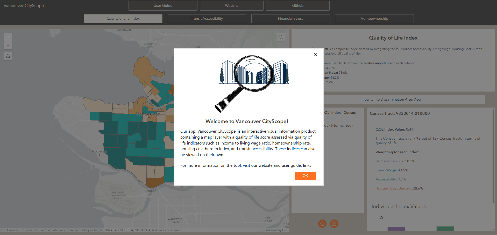

## App layout and how to use each component
Here is the main page:
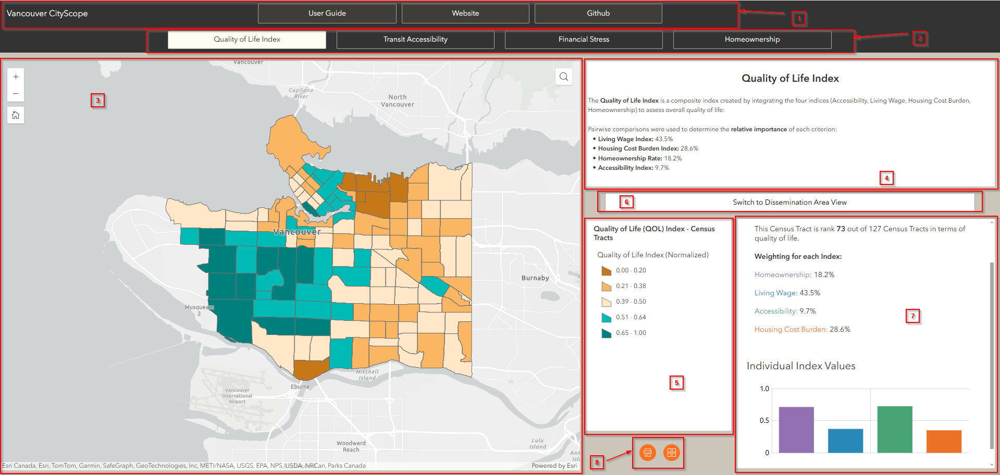

1. Header - contains links to our site, user guide, and github pages, click on the buttons to interact.  
2. Indices bar - click on each button to flip between the indices. 
3. Map - Main map, displays the indices, has a search bar to search for addresses, can zoom in and out, and return to initial extent. The user can select an individual census tract or dissemination area by clicking on the map. 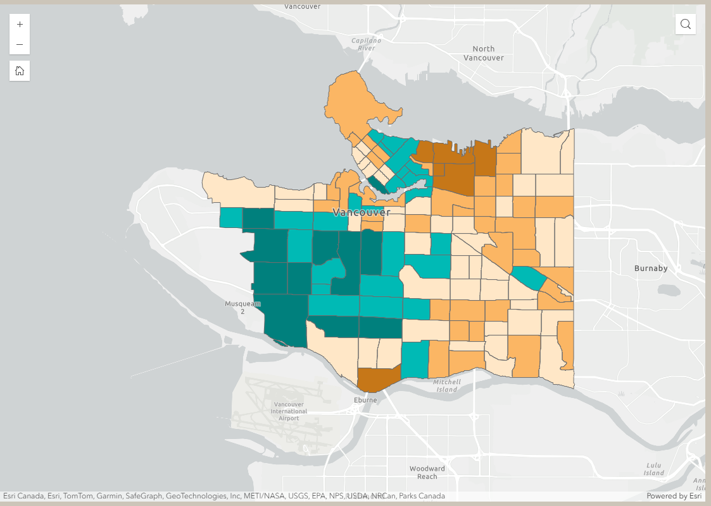
4. Index - contains a short explanation for each index, for the user to better understand what they are looking at. 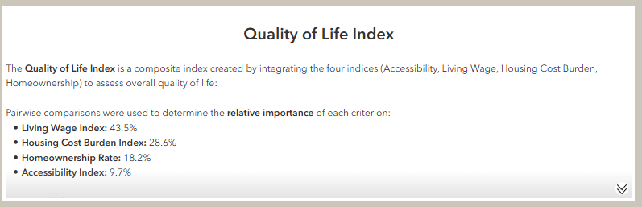
5. Legend - shows how values are mapped visually.    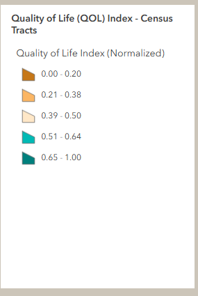
6. View switcher - switch between census tract and dissemination area view.  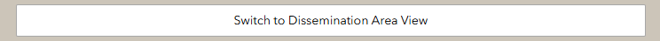
7. Feature information widget - Configured to show relevant information and comparison data for each index.    Quality of life:   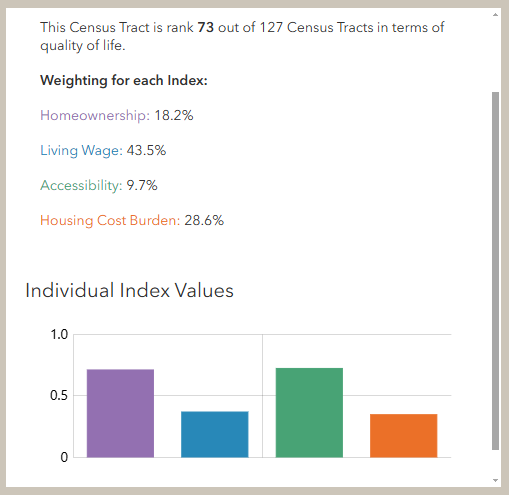    Housing Cost Burden:      
Hover over the chart to view the breakdown of the information.      
8. Widget controller - The user can switch basemaps and print    Basemaps - click to switch:   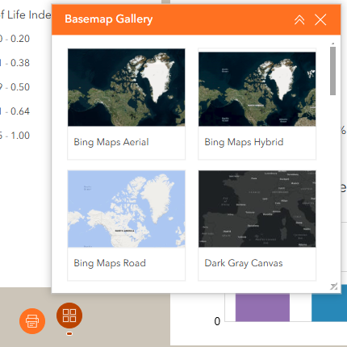    Print - the user can select format, title, resolution, and other settings to generate a pdf map:       Once the output is generated, the user can view or download them in this tab:   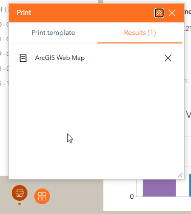

## Additional information

The Accessibility Index section contains a buildings view, which has the accessibility index value for each building in the city. When the user selects on a census tract or dissemination area:   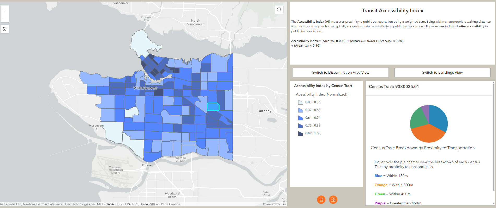    They can click on switch to buildings view:     And the tool will zoom into whichever area they selected to show the buildings in it:  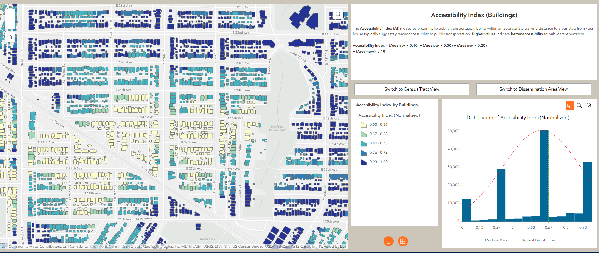  

